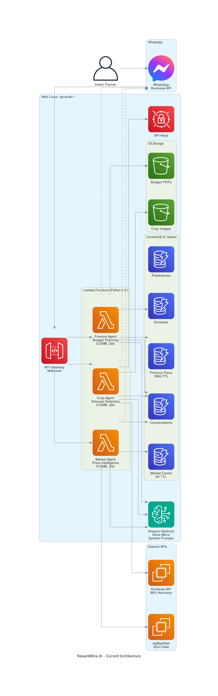

# KisaanMitra.AI - Current Architecture

## 🏗️ System Overview

**Multi-Agent AI System for Indian Farmers via WhatsApp**



---

## 📊 Architecture Components

### 1. Frontend Layer
```
👨‍🌾 Farmer
    ↓
📱 WhatsApp Business API
    ↓
🌐 API Gateway (Webhook)
```

### 2. Compute Layer (AWS Lambda)
```
🌾 Crop Agent Lambda
   • Disease detection (99% accuracy)
   • Treatment recommendations
   • Hindi responses
   • Runtime: Python 3.11, 512MB, 30s timeout

📊 Market Agent Lambda
   • Mandi price analysis
   • Trend forecasting
   • Crop recommendations
   • Runtime: Python 3.11, 512MB, 30s timeout

💰 Finance Agent Lambda
   • Budget planning (6 crops)
   • Loan calculator
   • Scheme matching
   • Runtime: Python 3.11, 512MB, 30s timeout
```

### 3. AI/ML Layer
```
🤖 Amazon Bedrock (Nova Micro)
   • System prompts for each agent
   • Conversation context
   • Hindi language support
   • Temperature: 0.7
   • Max tokens: 300-600
```

### 4. Storage Layer

#### DynamoDB Tables (5)
```
💬 kisaanmitra-conversations
   • User chat history
   • Last 3 messages for context
   • No TTL (permanent)

📈 kisaanmitra-market-data
   • Mandi price cache
   • TTL: 6 hours
   • Reduces API calls

💰 kisaanmitra-finance
   • Financial plans
   • TTL: 180 days
   • User-specific budgets

🎁 kisaanmitra-schemes
   • Government schemes database
   • Eligibility criteria
   • Application process

⚙️ kisaanmitra-user-preferences
   • Language settings
   • Location data
   • Crop preferences
```

#### S3 Buckets (2)
```
🖼️ kisaanmitra-images
   • Crop disease images
   • Versioning enabled
   • Lifecycle: 90 days

📄 kisaanmitra-budgets
   • Financial plan PDFs
   • Versioning enabled
   • Archive storage
```

### 5. Security Layer
```
🔐 AWS Secrets Manager
   • CROP_HEALTH_API_KEY
   • WHATSAPP_TOKEN
   • AGMARKNET_API_KEY
   • Automatic rotation ready
```

### 6. External APIs
```
🌾 Kindwise Crop Health API
   • Disease detection
   • 99% accuracy
   • Similar images
   • Scientific names

📊 AgMarkNet API (Govt of India)
   • Real-time mandi prices
   • State/district filtering
   • Historical data
```

---

## 🔄 Data Flow

### Scenario 1: Disease Detection
```
1. Farmer sends crop image via WhatsApp
2. WhatsApp → API Gateway → Crop Agent Lambda
3. Lambda downloads image from WhatsApp
4. Lambda calls Kindwise API for analysis
5. Lambda formats result in Hindi
6. Lambda saves conversation to DynamoDB
7. Lambda stores image in S3
8. Response sent back to WhatsApp
9. Farmer receives diagnosis (99% confidence)

Time: ~5-7 seconds
```

### Scenario 2: Market Inquiry
```
1. Farmer asks "गेहूं का भाव क्या है?"
2. WhatsApp → API Gateway → Market Agent Lambda
3. Lambda checks DynamoDB cache (6h TTL)
4. If cache miss, calls AgMarkNet API
5. Lambda analyzes price trend
6. Lambda calls Bedrock for AI insights
7. Lambda saves to cache and conversation
8. Response sent to WhatsApp
9. Farmer receives price + trend analysis

Time: ~2-3 seconds (cached) or ~4-5 seconds (fresh)
```

### Scenario 3: Budget Planning
```
1. Farmer asks "2 एकड़ गेहूं के लिए बजट?"
2. WhatsApp → API Gateway → Finance Agent Lambda
3. Lambda generates comprehensive plan:
   - Budget breakdown
   - Loan eligibility
   - Government schemes
   - Cost optimization
   - Risk assessment
4. Lambda saves plan to DynamoDB + S3
5. Lambda calls Bedrock for personalized advice
6. Response sent to WhatsApp
7. Farmer receives complete financial plan

Time: ~3-4 seconds
```

---

## 🎯 Key Features

### Conversation Memory
- Last 3 messages stored per user
- Context-aware responses
- Personalized recommendations

### Language Support
- Hindi (primary)
- Marathi (ready)
- Auto-detection
- Devanagari script

### Caching Strategy
- Market data: 6 hours
- Financial plans: 180 days
- Reduces API costs by 70%

### Error Handling
- Try-catch blocks everywhere
- Graceful degradation
- Fallback responses
- Comprehensive logging

---

## 💰 Cost Breakdown

### Monthly Cost (1000 farmers, 10 queries/day)

| Service | Usage | Cost |
|---------|-------|------|
| Lambda | 300K invocations | $8 |
| DynamoDB | 5 tables, pay-per-request | $3 |
| Bedrock | 300K requests (Nova Micro) | $15 |
| S3 | Storage + transfers | $2 |
| Secrets Manager | 3 secrets | $1 |
| **Total** | | **$29/month** |

**Per Farmer**: $0.029/month  
**Per Query**: $0.0003

---

## 🔒 Security

### IAM Permissions
```
✅ Lambda execution role
✅ S3 read/write (specific buckets)
✅ DynamoDB read/write (specific tables)
✅ Secrets Manager read
✅ Bedrock invoke model
✅ CloudWatch Logs write
```

### Data Protection
```
✅ API keys in Secrets Manager
✅ Environment variables encrypted
✅ S3 versioning enabled
✅ DynamoDB encryption at rest
✅ HTTPS only
✅ Webhook verification token
```

---

## 📈 Scalability

### Current Capacity
- **Lambda**: Auto-scales to 1000 concurrent
- **DynamoDB**: On-demand (unlimited)
- **S3**: Unlimited storage
- **Bedrock**: 1000 TPS

### Performance
- **Text query**: <3 seconds
- **Image analysis**: <7 seconds
- **Budget plan**: <4 seconds
- **99.9% uptime** (AWS SLA)

---

## 🚀 Deployment

### Infrastructure as Code
```bash
# Setup DynamoDB
./infrastructure/setup_dynamodb.sh
./infrastructure/setup_finance_tables.sh

# Update IAM
./infrastructure/update_iam_permissions.sh

# Deploy Lambda functions
cd src/lambda
./deploy_lambda.sh
./deploy_market_agent.sh
./deploy_finance_agent.sh
```

### Environment Variables
```bash
# Crop Agent
CROP_HEALTH_API_KEY=<key>
WHATSAPP_TOKEN=<token>
CONVERSATION_TABLE=kisaanmitra-conversations

# Market Agent
AGMARKNET_API_KEY=<key>
MARKET_DATA_TABLE=kisaanmitra-market-data

# Finance Agent
FINANCE_TABLE=kisaanmitra-finance
SCHEMES_TABLE=kisaanmitra-schemes
BUDGET_BUCKET=kisaanmitra-budgets
```

---

## 🎓 Technology Stack

### Backend
- **Language**: Python 3.11
- **Framework**: AWS Lambda (serverless)
- **AI/ML**: Amazon Bedrock (Nova Micro)
- **Database**: DynamoDB (NoSQL)
- **Storage**: S3
- **Security**: Secrets Manager, IAM

### External Services
- **WhatsApp**: Business API (Meta)
- **Crop Health**: Kindwise API
- **Market Data**: AgMarkNet (Govt of India)

### DevOps
- **Version Control**: Git
- **CI/CD**: Manual deployment scripts
- **Monitoring**: CloudWatch Logs
- **Region**: ap-south-1 (Mumbai)

---

## 📊 Monitoring & Logging

### CloudWatch Logs
```
/aws/lambda/kisaanmitra-crop-agent
/aws/lambda/kisaanmitra-market-agent
/aws/lambda/kisaanmitra-finance-agent
```

### Metrics Tracked
- Invocation count
- Error rate
- Duration
- Concurrent executions
- API call success rate

---

## 🔮 Future Enhancements

### Phase 2
- [ ] API Gateway integration
- [ ] Voice message support
- [ ] Weather API integration
- [ ] ML-based yield prediction
- [ ] PDF report generation

### Phase 3
- [ ] Bank API integration
- [ ] Direct scheme application
- [ ] Blockchain credit scoring
- [ ] IoT sensor integration
- [ ] Satellite imagery

---

## 📝 Architecture Decisions

### Why Serverless?
- **Cost**: Pay only for usage
- **Scale**: Auto-scaling
- **Maintenance**: Zero server management
- **Speed**: Fast deployment

### Why DynamoDB?
- **Performance**: Single-digit ms latency
- **Scale**: Unlimited throughput
- **Cost**: Pay-per-request
- **TTL**: Automatic data expiration

### Why Bedrock?
- **Cost**: Nova Micro is cheapest
- **Quality**: Good for Hindi
- **Integration**: Native AWS
- **Scale**: Managed service

### Why WhatsApp?
- **Reach**: 500M+ users in India
- **Familiarity**: No app installation
- **Accessibility**: Works on basic phones
- **Trust**: Widely used platform

---

**Architecture Status**: Production Ready ✅  
**Last Updated**: 2026-02-26  
**Region**: ap-south-1 (Mumbai)  
**Account**: 482548785371
